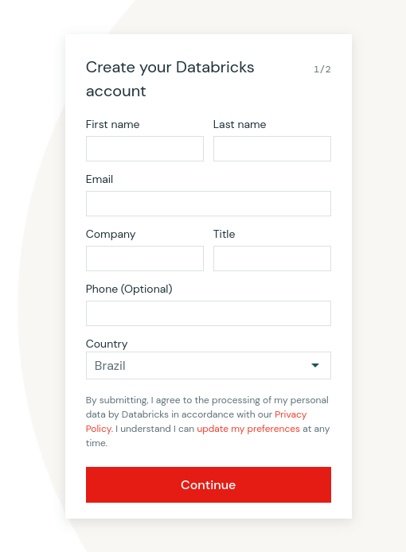
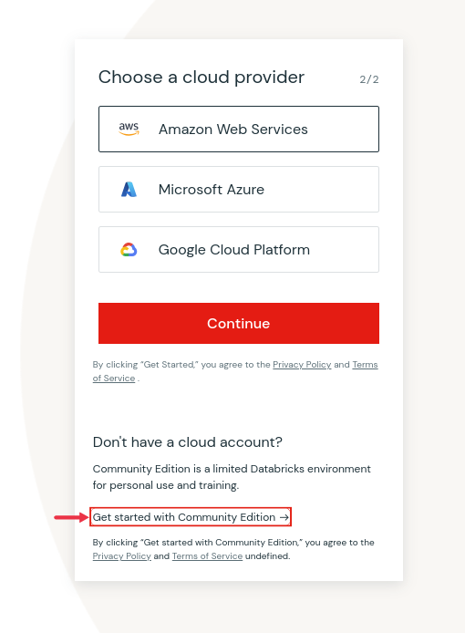
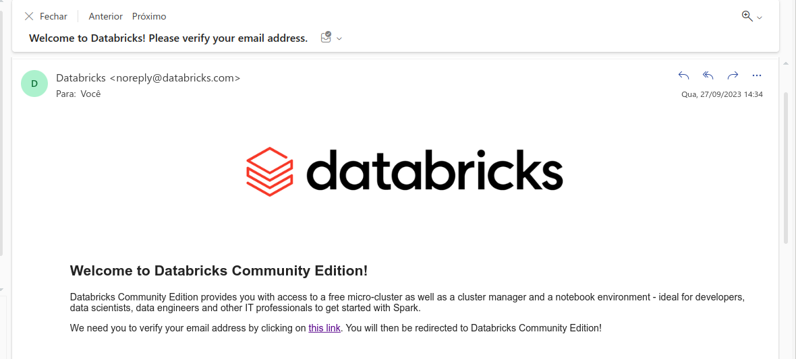
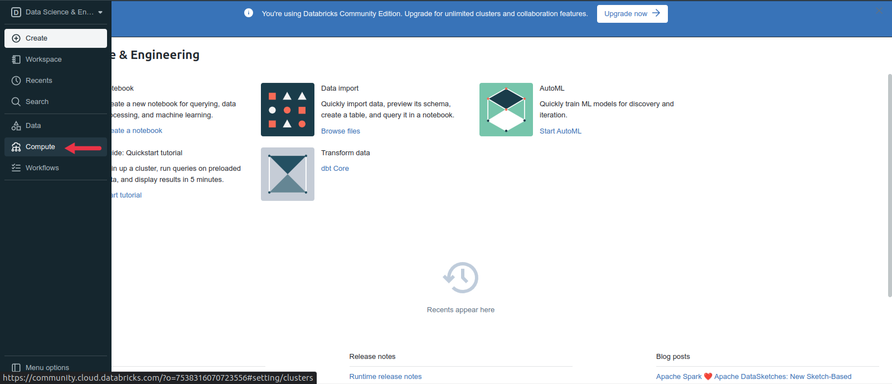
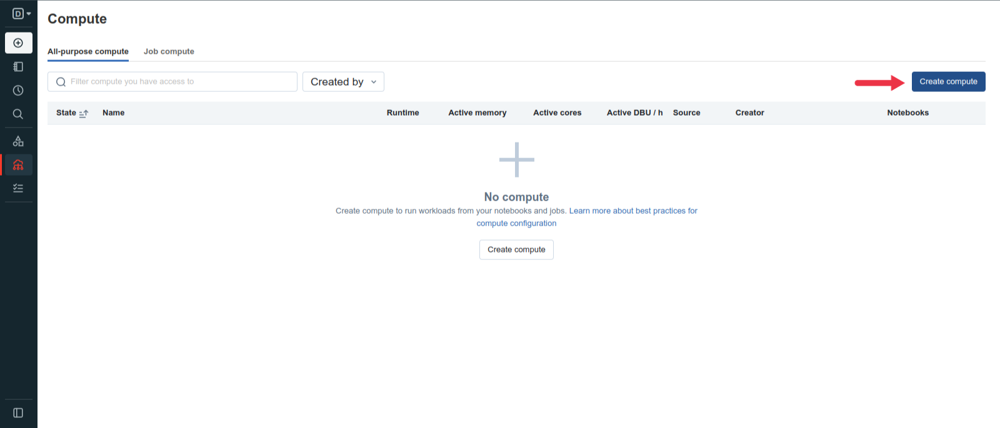
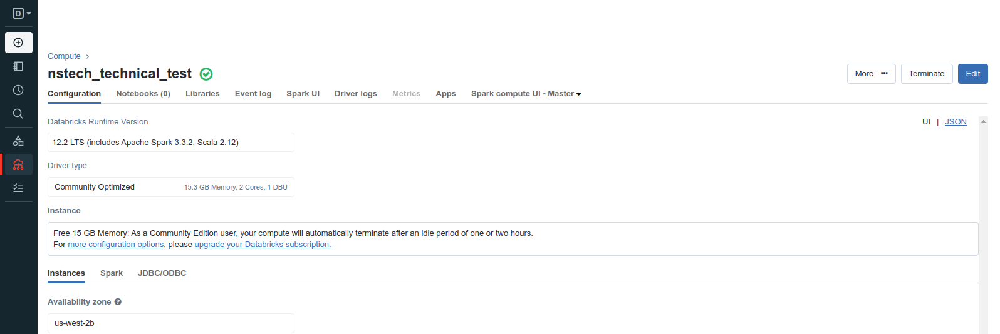
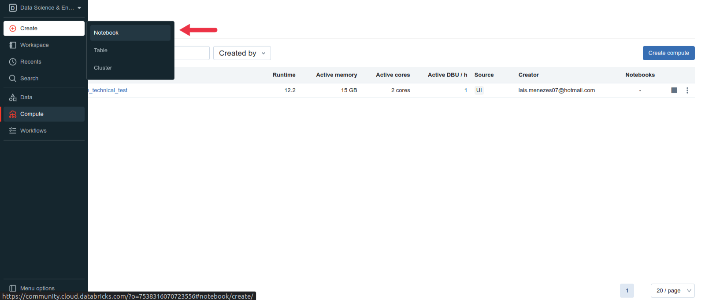
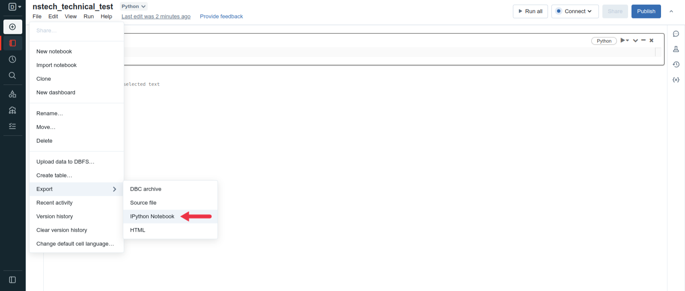

## **Bem vindo ao teste técnico da Nstech!**

*******
Tabelas de conteúdo 
 1. [Sobre](#about)

 2. [Passos para execução](#steps)

    [Cadastro Databricks](#signup)

    [Criação Cluster Databricks](#createcluster)

    [Criar e Salvar Notebook Databricks](#createnotebook)

 3. [Descrição do Desafio Técnico](#description)

 4. [Contato](#contact)

*******

 

### Sobre

Bem vindo ao teste técnico para admissão no Datalake da NSTech, esse desafio busca avaliar seus conhecimentos em extração, manipulação e escrita de dados. Durante o teste você poderá usar Python (incluindo Pyspark) e SQL para resolver o case especificado. Inicialmente, traremos o passo a passo para o aplicante ter acesso ao ambiente de execução do teste. Desse modo, o próximo passo é a execução do Desafio Técnico, o qual tem uma seção detalhando as atividade que devem ser realizadas. 

### Passos para execução

1. Criar conta de acesso e cluster no Databricks Community:

    

    #### Cadastro Databricks

    Acesse <a href='https://www.databricks.com/try-databricks#account'>***Databricks Community***</a> e siga os passos ilustrados.

    ***Tela 1 - Cadastro Databricks***

    Preencha os seus dados cadastrais nos campos ilustrados.
    <figure>
    
    </figure>

    ***Tela 2 - Cadastro Databricks***

    Na tela posterior selecione a opção circulada de vermelho, que define seu cadastro no Databricks Community.
    <figure>
    
    </figure>

    ***Tela 3 - Cadastro Databricks***

    Acesse seu email cadastrado para confirmar sua conta e criar sua senha.
    <figure>
    
    </figure>

    

    #### Criação Cluster Databricks

    Nesse momento, vamos ilustrar a crição do cluster no Databricks Community.

    ***Tela 1 - Criação Cluster Databricks***

    Clique no botão de **Compute**, destacado na imagem:
    <figure>
    
    </figure>

    ***Tela 2 - Criação Cluster Databricks***

    Na tela posterior clique em **Create compute**, destacado na imagem:
    <figure>
    
    </figure>

    ***Tela 3 - Criação Cluster Databricks***

    Na tela posterior preencha em **Compute name** e clique em **Create compute**, destacado na imagem:
    <figure>
    
    </figure>

    ***Tela 4 - Criação Cluster Databricks***

    Por fim, segue a imagem do cluster iniciado e pronto para uso.
    <figure>
    
    </figure>

2. Criar Notebook para execução do desafio proposto e esportação do arquivo final:

    

    #### Criação Notebook Databricks

    ***Tela 1 - Criação Notebook Databricks***

    No botão de **Create** escolha a opção **Notebook**, assim você está apto para executar o desafio proposto aqui na seção ***[Descrição do Desafio Técnico](#description)***
    <figure>
    
    </figure>

    ***Tela 2 - Salvar Notebook Databricks***

    Ao fim da execução do desafio clique em **File** -> **Export** -> **IPython Notebook**, para exportar seu arquivo de teste (.ipython) e enviar para time de pessoas da NStech.  
    <figure>
    
    </figure>

### Descrição do Desafio Técnico

Você é analista de dados da Companhia Aérea NstechAir e precisa ajudar o time de fidelização da escolher onde serão feitas as próximas 5 salas VIP da companhia. Sua escolhe deve maximizar o a quantidade de passageiros atendidos e minimizar o desconforto dos passageiros afetados por atrasos.

Ao longo do desafio você deve:

1. Criar uma tabela a partir do CSV oferecido a você pelo time de vendas;

O arquivo dentro da pasta **src** a seguir:[Arquivo CSV](./src/voos.csv)

2. Limpar dados de para garantir que as datas funcionem e que caracteres especiais não atrapalhem análises nos campos de texto;

3. Criar dimensões ligadas aos países em que operamos, aeroportos que usamos, pilotos da companhia, status dos voos e datas dos voos;

4. Realizar análises sobre os dados e emitir um parecer para o time de fidelidade sobre: "Em quais aeroportos cada sala deve ser construída e porquê?";

5. Realizar análises sobre os dados e emitir um parecer para o time de treinamentos se: "Há relação entre os atrasos e os pilotos?", para que haja algum treinamento específico;

6. Ao final do desafio você precisa entregar ao time de pessoas da NStech um arquivo com seu notebook, análises e pareceres sobre cada um dos dois casos, detalhado em: ***[Criar e Salvar Notebook Databricks](#createnotebook)***

### Contato

Em caso de dúvidas ou dificuldades, basta entrar em contato com a pessoa responsável pelo seu processo seletivo. Em caso de necessidade, algum membro do time de engenharia será alocado para te ajudar.