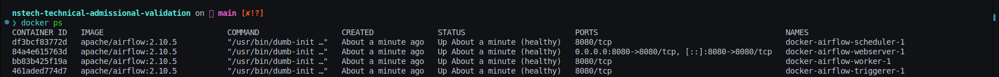

## **Bem vindo ao teste técnico da NSTech!**

*******
Tabelas de conteúdo 
 1. [Sobre](#about)

 2. [Passos para execução](#steps)

 3. [Descrição do Desafio Técnico](#description)

 4. [Contato](#contact)

*******
<div id='about'/> 

### Sobre

Bem-vindo ao teste técnico para admissão na vaga de Engenharia de Dados no Datalake da NSTech, esse desafio busca avaliar seus conhecimentos em orquestração, manipulação e análise de dados. Durante o teste você poderá usar Python (incluindo Pyspark) e SQL para resolver o case especificado. Inicialmente, traremos o passo a passo para o aplicante construir o ambiente de execução do teste. Desse modo, o próximo passo é a execução do Desafio Técnico, o qual tem uma seção detalhando as atividade que devem ser realizadas. 

<div id='steps'/>

### Passos para execução

1. Instalação do Docker Engine:

    Inicialmente, você precisa ter o Docker instalado. Certifique-se de que ele está devidamente instalado antes de prosseguir com o deploy do Airflow. O ícone redireciona você para a página oficial do Docker.

    * [![Docker][Docker-logo]][Docker-url]

2. Deploy do Airflow:

    Posteriormente, o aplicante precisa seguir o passo a passo de execução do docker compose referente ao Airflow 2.10.5 via terminal com os seguintes comandos : [Docker Compose](./airflow/docker-compose.yaml)

    * Comando para inicializar o banco de dados do Airflow:
    ```sh
    docker compose -f airflow/docker-compose.yaml up airflow-init
    ```
    * Comando para inicializar os demais serviços do Airflow:
    ```sh
    docker compose -f airflow/docker-compose.yaml up -d
    ```
3. Validação de execução do ambiente:
    * Comando para checar o funcionamento do ambiente Airflow 2.10.5:

    ```sh
    docker ps
    ```

    * Imagem de validação dos containers Airflow (status - healthy)

    

4. Acesso ao Airflow localmente:
    
    Acesse em um navegador de sua preferência o Airflow na url: [Airflow-url] - http://localhost:8080

    Insira:

        Username: airflow
        
        Password: airflow

    * Imagem de validação do login Airflow

    


<div id='description'/>

### Descrição do Desafio Técnico

Você ocupa uma cadeira de dados da Companhia Aérea NSTechAir e precisa criar de um Esquema Estrela (Star Schema) e auxiliar o time de fidelização a escolher onde serão feitas as próximas 5 salas VIP da companhia. Sua escolha deve maximizar a quantidade de passageiros atendidos e minimizar o desconforto dos passageiros afetados por atrasos.

Ao longo do desafio você deve:

1. Criar uma DAG com duas tasks referenciadas abaixo:

    * A task 1 será responsável pelo tratamento do dado no csv ([Arquivo CSV](./airflow/src/voos.csv)):
        - Limpar campos de texto retirando caracteres especiais e fazendo upper case dos mesmos;
        - Garantir que as datas funcionem como date no padrão: yyyy-mm-dd 

    * A task 2 será responsável pela construção do Star Schema:
        - Você deve criar 6 .csvs na pasta ([Results](./airflow/src/results)), definindo uma fato e 5 dimensões:
            1. fato_voos (dados tratados de voos);
            2. dim_paises (países em que operamos);
            3. dim_aeroportos (aeroportos em que operamos);
            4. dim_pilotos (pilotos da companhia);
            5. dim_status_voos (status dos voos);
            6. dim_datas_voos (datas dos voos).
            
2. Realizar uma análise em notebook ([Analysis](./airflow/src/analysis)) e emitir um parecer para as duas peguntas a seguir:
    
    * Em quais aeroportos cada sala deve ser construída e por quê?
    * Há relação entre os atrasos e os pilotos?

    Obs.: a análise à cerca dos dados precisa ser explicíta em termos de código sql e o parecer final pode ser apresentado em um breve texto com as conclusões e sugestões.

3. No final do desafio você precisa entregar ao time de pessoas da NSTech:
    * Um arquivo com a pasta results tendo seus 6 csvs do star schema e um print da DAG em funcionamento;
    * Um arquivo com o notebook (analise_voos.ipynb) contendo suas análises e seu parecer à cerca dos dados.

<div id='contact'/>

### Contato

Em caso de dúvidas ou dificuldades, basta entrar em contato com a pessoa responsável pelo seu processo seletivo. Em caso de necessidade, algum membro do time de Engenharia de Dados será alocado para te ajudar.

<!-- MARKDOWN LINKS & IMAGES -->
[Docker-logo]: https://img.shields.io/badge/docker-%230db7ed.svg?style=for-the-badge&logo=docker&logoColor=white
[Docker-url]: https://www.docker.com/
[Airflow-url]: http://localhost:8080
